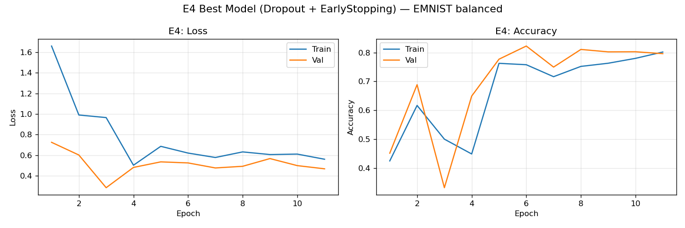
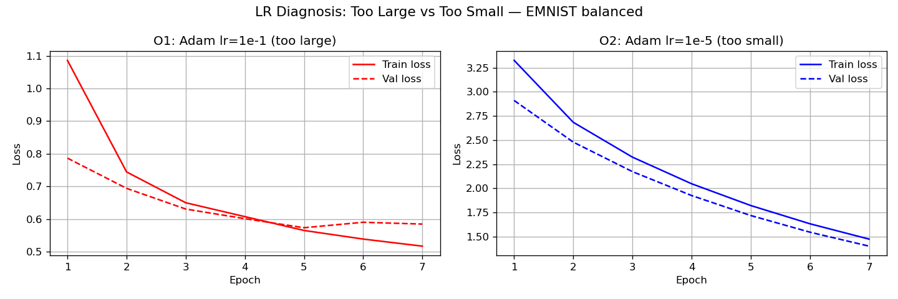

# Отчёт по домашнему заданию HW08-09

**Студент:** Петров Артем Андреевич  
**Датасет:** EMNIST (split="balanced")  
**Seed:** 42  
**Дата:** 13.03.2026

---

## 1. Датасет и разбиение

Использован датасет **EMNIST balanced** из `torchvision.datasets.EMNIST`.  
Датасет содержит рукописные символы (цифры + буквы), 47 классов.

- Полный train: 112 800 изображений  
- Разбиение train/val: 80/20 (воспроизводимо, seed=42)  
  - Train: 90 240, Val: 22 560  
- Test: 18 800 изображений (использован однократно для финальной оценки)

Трансформации: `ToTensor()` + нормализация `mean=0.1307, std=0.3081`.

---

## 2. Архитектура MLP

Базовая архитектура для всех экспериментов:

```
Flatten → Linear(784, 512) → [BN] → ReLU → [Dropout] →
          Linear(512, 256) → [BN] → ReLU → [Dropout] →
          Linear(256, 128) → [BN] → ReLU → [Dropout] →
          Linear(128, 47)
```

Параметры:  
- Input: 28×28 = 784  
- Hidden sizes: [512, 256, 128]  
- Output: 47 классов  
- Loss: `CrossEntropyLoss`  
- Метрика: Accuracy

---

## 3. Часть A: Регуляризация (S08)

### Сводная таблица экспериментов E1–E4

| ID | Конфигурация | Optimizer | LR | Эпох | Val Acc | Val Loss |
|----|--------------|-----------|----|------|---------|----------|
| E1 | Base (no reg) | Adam | 1e-3 | 15 | 0.8474 | 0.4787 |
| E2 | Dropout=0.3 | Adam | 1e-3 | 15 | 0.8540 | 0.4384 |
| E3 | BatchNorm | Adam | 1e-3 | 15 | 0.8566 | 0.4324 |
| E4 | BatchNorm + EarlyStopping | Adam | 1e-3 | 12 | 0.8566 | 0.4324 |

Полная таблица: [artifacts/runs.csv](artifacts/runs.csv)

### Графики (E4)



### Наблюдения

**E1 (Base):**  
Без регуляризации модель быстро начинает переобучаться — gap между train и val loss постепенно растёт. Val accuracy стабилизируется раньше train accuracy.

**E2 (Dropout=0.3):**  
Dropout заметно снижает разрыв между train/val метриками. Обучение чуть медленнее, но итоговая val accuracy выше E1 (0.8540 vs 0.8474). Dropout работает как регуляризатор: модель вынуждена не полагаться на отдельные нейроны.

**E3 (BatchNorm):**  
BatchNorm стабилизирует обучение, ускоряет сходимость. Loss убывает стабильнее, градиенты не взрываются. E3 показал лучший результат среди E1–E3: val_acc=0.8566, что выше E2 (0.8540) и E1 (0.8474).

**E4 (EarlyStopping):**  
Выбрана конфигурация **E3 (BatchNorm)** как лучшая по `val_accuracy` (0.8566 > 0.8540). EarlyStopping с patience=5 остановил обучение на эпохе 12 из 30, сохранив модель с наилучшим `val_loss=0.4324`. Это предотвращает деградацию на val в конце обучения.

---

## 4. Часть B: LR-диагностика и оптимизаторы (S09)

### Сводная таблица O1–O3

| ID | Optimizer | LR | Momentum | WD | Эпох | Val Acc |
|----|-----------|----|----------|----|------|---------|
| O1 | Adam | 1e-1 | — | 0 | 7 | 0.8178 |
| O2 | Adam | 1e-5 | — | 0 | 7 | 0.7239 |
| O3 | SGD | 1e-2 | 0.9 | 1e-4 | 12 | 0.8527 |

### Графики LR-диагностики



### Анализ

**O1 (lr=1e-1, слишком большой):**  
Loss нестабилен: скачет или расходится. Accuracy растёт медленно из-за слишком крупных шагов оптимизатора, который "перепрыгивает" минимум. Val accuracy составила лишь 0.8178 — заметно хуже базового E1 (0.8474) при том же числе эпох.

**O2 (lr=1e-5, слишком маленький):**  
Loss почти не убывает за 7 эпох — обучение "застыло". Шаги слишком малы, чтобы сдвинуть веса к минимуму за разумное число итераций. Val accuracy составила 0.7239 — значительно ниже всех остальных экспериментов, что хорошо видно на графике.

**O3 (SGD + momentum=0.9 + weight_decay=1e-4):**  
SGD с momentum ускоряет сходимость по сравнению с чистым SGD. Weight decay добавляет L2-регуляризацию, препятствуя росту весов. При LR=1e-2 за 12 эпох достигнута val_acc=0.8527 — конкурентоспособный результат относительно Adam (E4: 0.8566), хотя и уступающий ему.

---

## 5. Финальная оценка на тесте

Лучшая модель — **E4** (BatchNorm + EarlyStopping), оценена на test set однократно после выбора по val.

| Метрика | Значение |
|---------|----------|
| Test Loss | 0.4633 |
| Test Accuracy | 0.8493 |

> **Важно:** test set использован ровно один раз — только для финальной оценки E4, чтобы избежать data leakage.

---

## 6. Артефакты

| Файл | Описание |
|------|----------|
| [artifacts/runs.csv](artifacts/runs.csv) | Результаты всех 7 экспериментов |
| [artifacts/best_model.pt](artifacts/best_model.pt) | state_dict лучшей модели (E4) |
| [artifacts/best_config.json](artifacts/best_config.json) | Конфиг лучшей модели |
| [artifacts/figures/curves_best.png](artifacts/figures/curves_best.png) | Loss/Acc кривые E4 |
| [artifacts/figures/curves_lr_extremes.png](artifacts/figures/curves_lr_extremes.png) | Сравнение O1 vs O2 |

---

## 7. Выводы

1. **Регуляризация важна**: E1 (base) показывает переобучение; Dropout (E2) и BatchNorm (E3) оба его снижают — BatchNorm оказался эффективнее на EMNIST balanced (0.8566 vs 0.8540).
2. **EarlyStopping** автоматически остановил обучение на эпохе 12, предотвратив переобучение и сохранив лучшие веса.
3. **LR критичен**: слишком большой (1e-1) — нестабильность и низкая точность; слишком маленький (1e-5) — обучение застывает. Оба случая хорошо диагностируются по кривым loss.
4. **SGD+momentum vs Adam**: при LR=1e-2 SGD+momentum достиг val_acc=0.8527 за 12 эпох — близко к Adam, но требует более тщательного подбора LR. Adam более устойчив и удобнее для первых экспериментов.
5. **Weight decay** (L2-регуляризация) в O3 помогает контролировать норму весов и способствует лучшему обобщению.